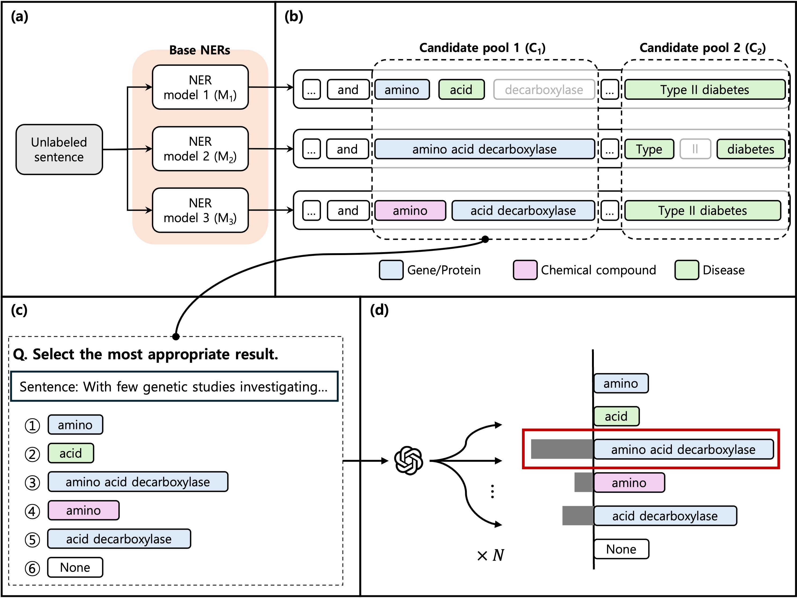

## DA-BioNER: Data Augmentation based on few-shot learning and distant supervision for Biomedical Named Entity Recognition.


This repository contains the official implementation of the paper: "DA-BioNER: Data Augmentation based on few-shot learning and distant supervision for Biomedical Named Entity Recognition."


##  Overview


**DA-BioNER** is a novel framework that integrates data augmentation, few-shot learning, and distant supervision to enhance biomedical NER. It leverages large language model (LLM)-based inference to ensemble predictions from multiple few-shot fine-tuned NER models, generating higher-quality labeled data with improved entity diversity and contextual integrity.


## Getting Started
### 1. Clone the repository
```bash
git clone https://github.com/DMnBI/DA-BioNER.git
cd DA-BioNER
```

### 2. Environment setup
```bash
conda create -n da-bioner python=3.9
conda activate da-bioner
pip install -r requirements.txt
python -m spacy download en_core_sci_md
```


## Dataset
We provide a sample subset of the BioRED dataset that has been converted into IOB format for demonstration and testing purposes.

### Data source
The sample data is extracted from the **[BioRED] (https://doi.org/10.1093/bib/bbac282)**, a high-quality manually annotated dataset for biomedical relation extraction.
Please refer to the original paper and website for more information:

>Luo, Ling, et al. "BioRED: a rich biomedical relation extraction dataset." Briefings in Bioinformatics 23.5 (2022): bbac282.
>https://doi.org/10.1093/bib/bbac282

⚠️ Note: This is a sample file only, not the full dataset. The IOB format version is not included in the original BioRED release and was generated by us for use in sequence labeling tasks.


## How to run
To run the full pipeline:

```bash
CUDA_VISIBLE_DEVICES=0 bash 01_Train_baseNER.sh
bash 02_GPT_ensemble.sh
```


## Evaluation
To evaluate the model:
```bash
CUDA_VISIBLE_DEVICES=0 bash 03_Evaluation.sh
```


## Citation

